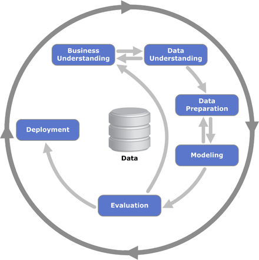

```{r setup,include=FALSE}
knitr::opts_chunk$set(echo = TRUE, warning = FALSE, message = FALSE)
```

```{r warning=FALSE, include=FALSE}
#install.packages("simpleSetup")
library(simpleSetup)

# Load packages, install if needed
packages <- c('tidyverse', 'viridis', 'readr')
library_install(packages)


library(readr)
churn <- read_csv("../data/WA_Fn-UseC_-Telco-Customer-Churn.csv")
```


# Introduction

## The Telecommunication Industry

The telecommunication industry consists of internet providers and telecommunication services, and it one of the largest industries in the information society. The traditional source of revenue for telecommunication industry has been callings, but it's changing to be texting, image and video processing due to the decreasing cost of accessing internet.

There are some characteristics of the telecom industry:

* It has heavy regulations by the governmental authorities (why).
* The market is highly competitive with different providers trying to provide the same service. Therefore, prices tend to decrease over time.
* Because there are large number of users national wide for the telecom and internet services, the amount of data gathered from customers by these providers is huge. Knowing how to extract valuable information from the customers can help telecom companies gain competitive edges against other competitors in the industry.

## Churn and its importance

## CRISP Framework

### Why doesn't this project use other modeling approaches

There are approaches which focus on the predictive modeling such as the predictive modeling approach used by Max Kuhn. This approach focuses in detail how a machine learning pipeline works, and will dive deep into the details of the decisions in modeling. Though this approach has certain benefits in helping us detailing the decisions made when conducting models, we instead use a more business-oriented framework, which is called the CRISP Framework.

### Benefits of the CRISP Framework

CRISP helps to build a data science project based on business results and financial benefits. I will follow this framework since it combines both the data science approach and the evaluation of the project. It connects the models with the return on investment to show the value or impact from the business. The reasons we also use CRISP is because:

* It's an agile method: it implements data science projects iteratively, helping us to overcome common sense thinking and help us to adjust to unexpected issues quickly.
* It's data science for business's sake. It focuses on the ROI of the project, helping us to evaluate KPIs and potential economic impact if the model is implemented. It also ensures that we always iterate our projects to meet the business goal.

In terms of churn, ROI is one of the most critical metrics in which we want to know besides the technical aspect of data science. Follow this framework step-by-step helps us to make sure we don't miss any important steps during the processIt allows us to focus on processes that require human involvement that requires creativity and intelligence, parts that have not been automated by machines.

### MORE DETAILS on CRISP
{width=250px}


# Project Implementation using CRISP Framework

## Business Understanding

### Types of churn

There are two types of churn.

* Voluntary churn: customers decide to leave the service and turn to another provider. Knowing why these types of churners decide to leave is critical for churn management
* Involuntary churn: there might be technical problems causing companies to discontinue the service itself. Voluntary churn will be the one we are interested in knowing more. 

It is essential for any business to be aware of:

* Who is about to churn
* When is the customer about to churn
* Why does a customer churn

## Data Understanding

Our dataset consists of 7043 profiles of telecom customers and is available via the IBM Watson Analytics2 website. The data contains two main types of variables:

* Customers' personal characteristics such as gender, partner, tenure status, senior.
* There usage behaviors such as phone service, internet service, online security, tech support, streaming TV, streaming movies, contract, payment method, and their monthly charges.

Both of these types of variables are beneficial for our predictive analysis. It helps us to detect whether their decisions to churn is based on personal characteristics or on their service usage behaviors. 

### Exploratory Visualisation

This is the step essential for our data understanding. It helps us to understand the relationships between variables and help us to evaluate potential analysis before the path of modeling.

```{r}
churn %>%
  mutate(SeniorCitizen = as.character(SeniorCitizen)) %>%
  select(-customerID) %>%
  select_if(is.character) %>%
  select(Churn, everything()) %>%
  gather(x, y, gender:PaymentMethod) %>%
  count(Churn, x, y) %>%
  ggplot(aes(x = y, y = n, fill = Churn)) +
  facet_wrap(~ x, ncol = 4, scales = "free") +
  geom_bar(stat = "identity", alpha = 0.5) +
  ylab("Variables") + xlab("Count") +
  scale_fill_viridis(discrete = TRUE) +
  scale_colour_viridis(discrete = TRUE, alpha = 0.1) +
  theme_linedraw(base_size = 7, base_line_size = 0, base_rect_size = 0.1) +
  theme(axis.text.x = element_text(angle = 25, hjust = 1, size = 4))
```

```{r}
churn %>%
  select(-customerID) %>%
  select(Churn, MonthlyCharges, tenure, TotalCharges) %>%
  gather(x, y, MonthlyCharges:TotalCharges) %>%
  ggplot(aes(x = y, fill = Churn)) +
    facet_wrap(~ x, ncol = 3, scales = "free") +
    geom_density(alpha = 0.5) +
    scale_colour_viridis( alpha = 0) +
    scale_fill_viridis(discrete = TRUE, alpha = 0) +
  ylab("Variables") + xlab("Density") +
  theme_linedraw(base_size = 7, base_line_size = 0, base_rect_size = 0.1)
```

These plots show patterns of differences between churners and non-churners:
* There are no noticable differences between churners and non-churners with categorical variables
* In terms of numerical variables plotted by the density plot, it is observed that churners are more likely to have higher monthly charges, more likely to be tenured and have higher charges compared to non-churners.

* regression analysis

### Data Preparation

Since a variety of formats are not able to implement using the raw data, I decided to (1) remove entries that have missing values, (2) transform variables that are factors into numeric variables, which are necessary for the implementation of decision trees and random forests, (3) split the entire data set into two, one is for training the variables, and another is for testing, and (4) remove columns that are not useful for analysis, like unique Customer ID.


## Modeling

### H2O - Automated Machine Learning

## Evaluation

